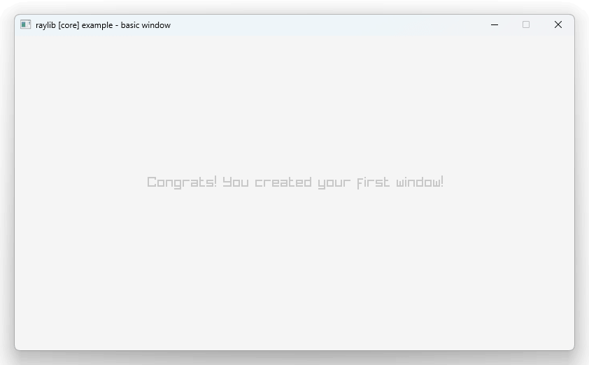
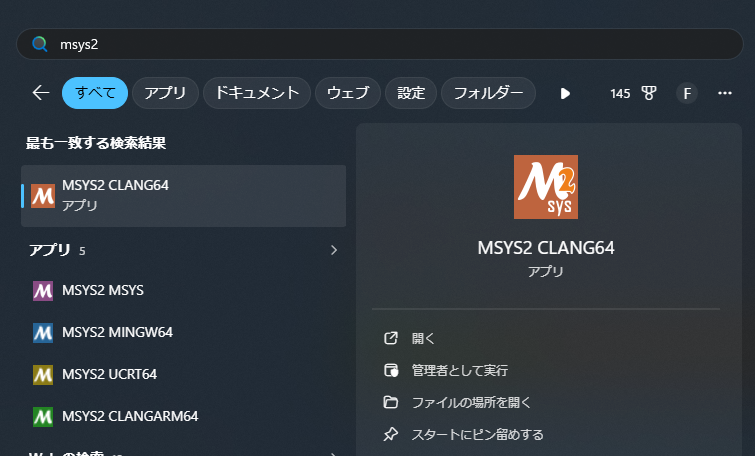
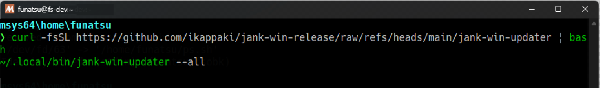

「スクリプト言語の中に直接C++のコードが書けて、ラッパーとか書かずに直接呼び出せたらなぁ」と思ったことはないだろうか。それを実現しようとしているのがJank言語で、まだまだ開発段階ではあるものの、少しずつ現実味を帯びようとしている。

https://jank-lang.org/

https://youtu.be/uspo8tDM5j4

<iframe width="560" height="315" src="https://www.youtube.com/embed/uspo8tDM5j4?si=Z3h3gQPRmSaps2di" title="YouTube video player" frameborder="0" allow="accelerometer; autoplay; clipboard-write; encrypted-media; gyroscope; picture-in-picture; web-share" referrerpolicy="strict-origin-when-cross-origin" allowfullscreen></iframe>

（※ 上記動画は https://jank-lang.org/blog/2025-10-03-community/ より転載。原著者はKyle Cesareさんで、 [Clojurians Slack](https://clojurians.slack.com/archives/C03SRH97FDK)にアップロードされたもの。）

一体何がすごいのかを伝えるのが少し難しいのだけれど、この技術が現実的になってきたというのは、他の動的言語にとっても大きなブレイクスルーだと思うので、まだBleeding-Edgeではあるものの、少し丁寧に記事にしてみようと思い立った。

## LLVM/C++の動的連携の何がすごいのか？

今から紹介しようとしているJank言語は、Lisp系の動的言語（≒ スクリプト言語）なのだけれど、動的言語なのですべてをランタイム（実行時）に呼び出す。

Pythonでも同様で、C-API (FFI) を使ってdllを呼び出すことによってTensorFlowやPyTorchなどが動いて、対話型開発ができている。

が、C言語との連携なら当たり前にできるのだけれど、もしC言語を介さない、C++との直接的な連携となるといきなりハードルが上がる。その黒魔術を実現するのがLLVMを使った[clang-repl](https://clang.llvm.org/docs/ClangRepl.html)などである。

clang-replの元になった[Cling](https://github.com/root-project/cling)は、過去にもCL-CXX-JITという実験的プロジェクトで使われていた。

https://github.com/Islam0mar/CL-CXX-JIT


上記GIF動画、なんとなく雰囲気が[先に上げた動画](https://youtu.be/uspo8tDM5j4)と似ていると感じないだろうか。

それもそのはずで、Jank言語がやろうとしていることはこの現代版であり、動的言語に直接C++を埋め込んで、LLVMを使って動的に呼び出し、ラッパーを何も書かずにC++と動的に対話させようとしているものだ。

## jank is C++

https://jank-lang.org/blog/2025-07-11-jank-is-cpp/

さて、LLVMでC++が動的に呼べる基盤が少しわかったところで、『[jank is C++](https://jank-lang.org/blog/2025-07-11-jank-is-cpp/)』という記事を少し見てみよう。

以下のコードはjankからnlohmann-jsonを呼び出す例なのだけれど、C++のコードとそのまんま連携できていることがわかる。

```clojure
(cpp/raw "#include <fstream>")
(cpp/raw "#include \"json.hpp\"")

(defn -main [& args]
  (let [file (cpp/std.ifstream. (cpp/cast cpp/std.string (first args)))
        json (cpp/nlohmann.json.parse file)]
    (println (cpp/.dump json 2))))
```

例えば `cpp/nlohmann.json.parse` は、文字通り nlohmann::json::parse を動的に呼び出せる。`cpp/cast` は、Jank内の動的オブジェクト（`jank::runtime::object`）をC++の型にキャストするものだ。

これを見て、[Nim言語](https://nim-lang.org/)を思い浮かべる人もいるかと思う。Nim言語でも、C/C++コードを直接埋め込める `{.emit.}` や、[nimline](https://github.com/sinkingsugar/nimline) などを使うことによって同様のことができる。

じゃあNimとjankの何が違うかというと、静的 (static) か動的 (dynamic) かの違いにある。

jankも最初期はNimと同様に、`cpp/raw`に書かれたC++コードをその場でコンパイルして呼び出していたのだが、コンパイル時間がかかりすぎてLLVMに移行したという経緯がある。ということはルーツややろうとしていることは似ていて、Nimはあくまでコンパイル時にそれを行って静的 (static) なC++コードを生み出して（C++にトランスパイルして）実行するのに対し、jankはそれをLLVMで動的 (dynamic) に、実行時 = ランタイムに行っている。

この静的 (static) か動的 (dynamic) かの両者の間にはたぶんかなり大きな溝があって、動的呼び出しのためにLLVMの大きなコードをバックエンドとして利用するデメリットも存在するのだけれど、それを実際に実現してしまったjank言語は、動的言語の新しい可能性を切り開いていると私は思う。

## C++が動的に呼べるメリット

C++が動的に呼べるということで、作者（[Jeaye Wilkerson](https://github.com/jeaye)さん）自身も念頭に置いているようだけれど、ゲーム開発にとても向いている。実際、最初に挙げたImGuiもゲーム開発でよく使われるもので、自分自身もここ数日いくつかのゲームライブラリを実際に呼べることを確認した。

https://github.com/funatsufumiya/jank-raylib-test/tree/main

https://github.com/funatsufumiya/jank-sdl3-test/tree/main

https://github.com/funatsufumiya/jank-trussc-test/tree/main

例えばRaylibの現時点でのデモは以下のようなコードになっている。



```clojure
(ns jank-raylib-test.main)

(cpp/raw "

#include <RaylibWrapper/c_api.h>

rlw::Color raywhite = {245, 245, 245, 255};
rlw::Color lightgray = { 200, 200, 200, 255 };

")

(defn -main [& args]
  (let [w 800
        h 450]
    (cpp/rlw_InitWindow w h "raylib [core] example - basic window")
    (cpp/rlw_SetTargetFPS 60)
    (while (cpp/! (cpp/rlw_WindowShouldClose))
           (do
             (cpp/rlw_BeginDrawing)
             (cpp/rlw_ClearBackground cpp/raywhite)
             (cpp/rlw_DrawText "Congrats! You created your first window!", 190, 200, 20, cpp/lightgray)
             (cpp/rlw_EndDrawing))) 
    (cpp/rlw_CloseWindow)))
```

SDL3の場合、現時点では以下のようになっていて、ほぼC++のコードそのまんまのところに、無理矢理jank関数へのコールバックを呼ぶ形になっている。こうやってC++との境界が曖昧なのが、良いところでもある。

```clojure
(ns jank-sdl3-test.main)

(cpp/raw "

#include <string>
#include <iostream>
#include <SDL3/SDL.h>
          
jank::runtime::oref<jank::runtime::object> frame_callback;
jank::runtime::oref<jank::runtime::object> init_callback;

SDL_Window *window = NULL;
SDL_Renderer *renderer = NULL;

void set_init_callback(jank::runtime::oref<jank::runtime::object> obj){
    init_callback = obj;
}

void set_frame_callback(jank::runtime::oref<jank::runtime::object> obj){
    frame_callback = obj;
}

void call_init_callback(){
  dynamic_call(init_callback);
}
          
void call_frame_callback(){
  dynamic_call(frame_callback);
}

int Init() {
    int ret = SDL_Init(SDL_INIT_VIDEO);
    if (ret < 0) {
        SDL_Log(\"SDL_Init() Error: %s\", SDL_GetError());
        return -1;
    }
    
    window = SDL_CreateWindow(\"HelloWorld SDL3\", 640, 480, 0);
    if (!window) {
        SDL_Log(\"SDL_CreateWindow() Error: \", SDL_GetError());
        return -1;
    }

    renderer = SDL_CreateRenderer(window, NULL);

    if (!renderer) {
        SDL_Log(\"SDL_CreateRenderer() Error: \", SDL_GetError());
        return -1;
    }

    // std::string renderer_name = SDL_GetRendererName(renderer);
    // std::cout << \"Renderer: \" << renderer_name << std::endl;

    call_init_callback();

    return 0;
}

void Term() {
    SDL_DestroyRenderer(renderer);
    SDL_DestroyWindow(window);
    SDL_Quit();
}

SDL_FRect mouseRect;

void Start() {
    SDL_Event event;
    bool running = true;

    mouseRect.x = mouseRect.y = -1000; // ensure it's offscreen at startup
    mouseRect.w = mouseRect.h = 50;

    // main loop
    while (running) {
        // go through all pending events until there are no more
        while (SDL_PollEvent(&event)) {
            switch (event.type) {
                case SDL_EVENT_QUIT: // triggered on window close
                    running = false;
                    break;
                case SDL_EVENT_KEY_DOWN: // triggered when user presses ESC key
                    if (event.key.key == SDLK_ESCAPE) {
                        running = false;
                    }
                case SDL_EVENT_MOUSE_MOTION:
                    mouseRect.x = event.motion.x - (mouseRect.w / 2.0f);
                    mouseRect.y = event.motion.y - (mouseRect.h / 2.0f);
                    break;
            }
        }

        // sine wave with 3 second period
        float sineWave = SDL_sinf((((float)(SDL_GetTicks() % 3000)) / 3000.0f) * 2.0f * SDL_PI_F);
        // multiply amplitude by 127 and shift by +127 to get 0..254 color range
        Uint8 r = (Uint8)(sineWave * 127.0f) + 127;
        // set shade of red
        SDL_SetRenderDrawColor(renderer, r, 0, 0, 255); // for SDL_RenderClear()

        // clear the window to red fade color
        SDL_RenderClear(renderer);
        
        call_frame_callback();

        // set draw color to white
        //SDL_SetRenderDrawColor(renderer, 255, 255, 255, 255); // for SDL_RenderFillRect()

        // draw mouse rectangle
        //SDL_RenderFillRect(renderer, &mouseRect);

        // draw everything to screen
        SDL_RenderPresent(renderer);
    }
}

void start() {
    int ret = Init();
    if (ret == 0) {    
        Start();
    }
    Term();
}
")

(def is_firsttime (atom true))

(defn init []
  (let [renderer_name (cpp/SDL_GetRendererName cpp/renderer)]
    (println "Renderer:" renderer_name))
  
  (println "init from jank!"))

(defn frame []
  (if @is_firsttime
    (do
      (println "first frame from jank!")
      (reset! is_firsttime false)))
  (cpp/SDL_SetRenderDrawColor cpp/renderer 255 255 0 255)
  (cpp/SDL_RenderFillRect cpp/renderer (cpp/& cpp/mouseRect)))

(defn -main [& args]
  (cpp/set_init_callback init)
  (cpp/set_frame_callback frame)
  (cpp/start))
```

RaylibやSDL3はC++ではなくC言語実装なのであまり恩恵がよくわからないかもしれないが、[3つ目のリンク](https://github.com/funatsufumiya/jank-trussc-test/tree/main)で挙げたTrussCはC++と直接連携していて、C++のオブジェクトや関数を相互呼び出ししている。

こうやって動的にC++が呼べると、スクリプト言語とC++の境界がだんだん曖昧になってくる。

jankにはClojureゆずりの[nREPL](https://nrepl.org/nrepl/index.html)という対話環境があって、Python等のように対話開発ができる。ということは、Jupyter Notebookなどで機械学習のコードが書かれているようなことが、今後C++でもできるようになってくる。そうすると、ゲーム開発などもそうやって対話的にできるようになる。

Godotなどで既に実現されている部分でもあるし、Unity/C#なんかでもごく当たり前のことなので、今更なにを言っているのだろうと思うかもしれないけれど、C++との境界が曖昧であれば、「このコードのこの部分遅いな―」と感じたらすぐC++にスイッチすることも容易にできるようになる。

Godotでもgdextensionを使って既にそれができはするものの、C++の短いコード片をすぐに埋め込めるかというとなかなかまだそこまでは至っていないし、jankも最初期にそうだったようにC++を都度コンパイルすると時間がかかり[^1]、開発イテレーションが遅くなってしまう。jankが目指しているのはそういう、C++とのシームレスな対話型開発の未来。

## 2026年3月時点でのjankの現状 / インストール方法

「おおそれはすごい、じゃあすぐ使ってみよう！」と思った人もいてくれると思うのだけれど、実はWindows上でjank言語が動くようになったのもごくごく最近の話。

UbuntuやMacであれば、[Installation](https://book.jank-lang.org/getting-started/01-installation.html)に書かれているように`apt`や`brew`で一発でインストールできるのだけど、Windows版 ([jank-win](https://github.com/ikappaki/jank-win)) は3月末現在でまだjank本体に完全には統合されていないフォークになっているので、次の手順を踏む必要がある。ただし近い将来は`winget`や`pacman`などでパッとインストールできるようにもなるかもしれない。

Windows上で動かすには[jank-win](https://github.com/ikappaki/jank-win)を現状使うのだけれど、まず[MSYS2](https://www.msys2.org/)をインストールする。そしてMSYS2 Clang64ターミナルを起動して、以下を実行する。

```bash
curl -fsSL https://github.com/ikappaki/jank-win-release/raw/refs/heads/main/jank-win-updater | bash
~/.local/bin/jank-win-updater --all
```




これだけで `jank repl` などを叩くと動くので、簡単といえば簡単かもしれない。MSYS Clang64ターミナル以外から呼び出すには、以下のようなbatファイルを `jank.bat` として保存して、パスの通っている場所に配置する。（`C:\msys64\clang64\bin` に直接パスを通してしまっても動くけれど、あまりおすすめはしない。）

```bat
@ECHO OFF
C:\msys64\clang64\bin\jank.exe %*
```

これでPowershellでも何でもjankが動くようになる。

## jank repl で遊ぶ

せっかくインストールできたのだから、少し遊んでみよう。

```
$ jank repl
user=> (+ 1 1)
2
```

`jank repl` と打ち込んで、`user=>` と出たら、`(+ 1 1)` と打つと `2` と表示される。

```
user=> (println "hello")
hello
nil
```

`(println "hello")` と打ち込むと、`hello`と返ってくる。`nil` と出るのは `println` 関数は返り値がない（void）から。

せっかくなのでC++の動的呼び出しもやってみよう。

```
user=> (cpp/raw "#include <iostream>")
nil
user=> (cpp/raw "void hello(){ std::cout << \"hello from C++!\" << std::endl; }")
nil
user=> (cpp/hello)
hello from C++!
nil
```

できただろうか？ `\"` （バックスペース・ダブルクオーテーション = 円記号・ダブルクオート）とかちょっと普段あまり打たない記号も含まれるので注意してほしい。

この時点でもう十分C++が呼び出せることはわかる。こうなるとJankの値をC++に渡してみたくなる。

```
user=> (cpp/raw "void hello2(std::string s){ std::cout << s << std::endl; }")
nil

user=> (cpp/hello2 "C++ Jank Interop")
C++ Jank Interop
nil
```

おお、普通にできる。数値はどうだろう？

```
user=> (cpp/raw "void hello3(int a, float b){ std::cout << a << \", \" << b << std::endl; }")
nil
user=> (cpp/hello3 1 2.0)
1, 2
nil
```

おお、これもまた普通にできる。すごい。

（さらに詳しいC++との連携については、[Working with native values](https://book.jank-lang.org/cpp-interop/native-values.html)などを参考にしてほしい。）

## C++のソースやdllの渡し方

実際C++と連携すると、includeなどのソースや、dllなどのファイルを渡したい場合もあると思う。

Jankのヘルプを見てみると、そうした引数も準備されていて、gccやclangと同様に、`-I` でインクルードパスを渡すことができ、`-L` でlibのパス、`-l` でライブラリへのリンクを指定する。

```
$ jank -h

jank compiler jank-0.1-alpha

The jank compiler is used to evaluate and compile jank, Clojure, and C++ sources.

COMMANDS
  run                         Load and run a file.
  compile-module              Compile a module (given its namespace) and its dependencies.
  repl                        Start up a terminal REPL client and server.
  cpp-repl                    Start up a terminal C++ REPL client.
  run-main                    Load and execute -main.
  compile                     Ahead of time compile project with entrypoint module containing
                              -main.
  check-health                Provide a status report on the jank installation.

OPTIONS
  -h,     --help              Print this help message and exit.
          --module-path <path>
                              A colon separated list of directories, JAR files, and ZIP files
                              to search for modules.
          --profile           Enable compiler and runtime profiling.
          --profile-output <path> [default: jank.profile]
                              The file to write profile entries (will be overwritten).
          --perf              Enable Linux perf event sampling.
          --gc-incremental    Enable incremental GC collection.
          --debug             Enable debug symbol generation for generated code.
          --direct-call       Elides the dereferencing of vars for improved performance.
  -O,     --optimization <0 - 3>
                              The optimization level to use for AOT compilation.
          --codegen <llvm-ir, cpp> [default: cpp]
                              The type of code generation to use.
          --eagerness <lazy, eager> [default: lazy]
                              How eagerly to JIT compile functions.
  -o,     --output <path>
                              The name of the output file.
          --output-dir <path>
                              The prefix to use for object files. [default: target]
  -I,     --include-dir <path>
                              Absolute or relative path to the directory for includes
                              resolution. Can be specified multiple times.
  -D,     --define-macro <name>
                              Defines a macro. The value will be 1, if omitted. Can be specified
                              multiple times.
  -L,     --library-dir <path>
                              Absolute or relative path to the directory to search dynamic
                              libraries in. Can be specified multiple times.
  -l <lib>                    Library identifiers, absolute or relative paths eg. -lfoo for
                              libfoo.so or foo.dylib. Can be specified multiple times.
```

あとはgccなどと同じなので、これで遊んでもらっても十分なのだけれど、[Hello Leiningen!](https://book.jank-lang.org/getting-started/03-hello-leiningen.html) というドキュメントに記載があるように、Clojureに元々ある[Leiningen](https://leiningen.org/)というビルドシステムとjankを統合させることもできる。

やり方は[Hello Leiningen!](https://book.jank-lang.org/getting-started/03-hello-leiningen.html)に書いてある通りで、[Leiningen公式ページ](https://leiningen.org/)に記載の方法でまずLeiningenをインストールする。Windowsなら[lein.bat](https://raw.githubusercontent.com/technomancy/leiningen/stable/bin/lein.bat)をダウンロードしてパスを通し、Mac/Linuxなら[lein](https://raw.githubusercontent.com/technomancy/leiningen/stable/bin/lein)をダウンロードしてパスを通す。

あとは `lein new org.jank-lang/jank jank-test` などで新規プロジェクトを作り、`project.clj` を少しいじって先程のインクルードパスなどにあたる部分を調整する。

```clojure
(defproject jank-test "0.1-SNAPSHOT"
  :license {:name "MPL 2.0"
            :url "https://www.mozilla.org/en-US/MPL/2.0/"}
  :dependencies []
  :plugins [[org.jank-lang/lein-jank "0.6"]]
  :middleware [leiningen.jank/middleware]
  :main jank-test.main
  :jank {:include-dirs ["include"]
         :library-dirs ["lib"]
         :linked-libraries ["sokol", "glew"]}
  :profiles {:base {:jank {:output-dir "target/debug"
                           :optimization-level 0}}
             :release {:jank {:output-dir "target/release"
                              :optimization-level 2}}})
 ```

 肝心なのは以下の部分で、この箇所はjankプラグイン向けの指定となる。

 ```clojure
:jank {:include-dirs ["include"]
       :library-dirs ["lib"]
       :linked-libraries ["sokol", "glew"]}
 ```

本当はCMakeとかzigとかと同じように、MacやWindowsなどのプラットフォームごとに分岐したいところなのだけれど、現時点ではそうしたパラメータはないようだ。今後そういう細かな対応もできるようになってくると思うのだけれど、現状では例えば `:linked-libraries` に `glew` とあれば、Windowsでは `libglew.dll`、Macでは `libglew.dylib`、Linuxでは `libglew.so` を `:library-dirs` から探すというシンプルな対応になっている。（jankコマンドから直接指定した場合も同様。）

実際にゲームライブラリを使うデモとしては、先に挙げたRaylib等のLeiningenプロジェクトを参考にしてもらえればと思う。

https://github.com/funatsufumiya/jank-raylib-test/tree/main

実際バインディングしてみた感触としては、あまり大きなC++ヘッダをいきなり読み込ませると、名前空間が衝突したり、必要なライブラリが不足したりしがちなので、別のCMakeプロジェクトなどでdllを作成して、それを軽量なC/C++ヘッダから呼び出すという、Pythonなどの動的言語でよく使われている方法を使うのが現状は無難。（それでも、C++へのラッパーコードなどが不要な恩恵は大きい。）

## まとめ

さて、だいぶ早足になったのだけれど、jankの概要と、jankが現実味を帯びてきている現状がわかってもらえたら嬉しい。ここで改めて最初に挙げた動画をもう一度見てみると、何をしているか少しわかるかもしれない。

https://youtu.be/uspo8tDM5j4

<iframe width="560" height="315" src="https://www.youtube.com/embed/uspo8tDM5j4?si=Z3h3gQPRmSaps2di" title="YouTube video player" frameborder="0" allow="accelerometer; autoplay; clipboard-write; encrypted-media; gyroscope; picture-in-picture; web-share" referrerpolicy="strict-origin-when-cross-origin" allowfullscreen></iframe>

`jank repl` を立ち上げると、以下のように[nREPL Server](https://nrepl.org/nrepl/index.html)の案内が出て、nREPLで対話開発ができるようになるのだけれど、上記はそれを使ったデモとなっている。（注: 上記動画は私自身によるものではなくて、Clojurians Slack上のKyle Cesareさんの投稿をリポストしたもの。）

```
$ jank repl
jank nREPL server is running on nrepl://127.0.0.1:59052
user=>
```

（例えばVSCodeならCalvaを使えばnREPLに繋ぐことができる。使い方は割愛。）

こうやって動的に対話型開発ができて、C++とシームレスに対話できる未来が開かれることは、多くの動的言語にとって魅力的な可能性といえるのではないかと思う。もしかしたらこの技術基盤が今後応用されて、PythonやJupyter Notebookのような環境ができてくるかもしれないし、書いてて重いなと思った部分はすぐC++に書き換えたりみたいな、本当にシームレスな対話型開発ができる未来も本当にすぐそこに来ている。

（jankは現在進行系で開発中で、まだだいぶBleeding-Edgeなので、ホビー用途など、クリティカルでない用途で少しずつ試していただければ。C++が呼べるとはいえ、jank自体の動作速度は現状ClojureやClojureScriptほど速くはないので、過度な期待は禁物。）

[^1]: [Bun](https://bun.sh/)や[V言語](https://vlang.io/)などで、[tcc (TinyCC)](https://www.bellard.org/tcc/)を使ってC言語を直接埋め込もうとする動きはある。tccでパースできるC言語は完璧でないものの、tccをうまく使えば高速なコンパイルが実現できるので、対話開発の一助になる可能性は大きい。ただしC++ではなくC。
